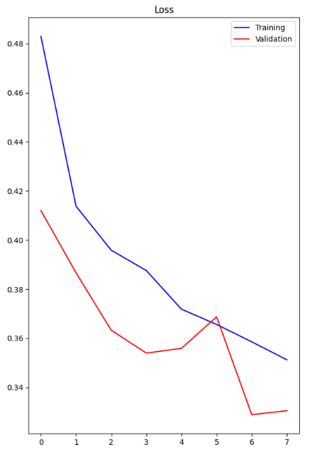
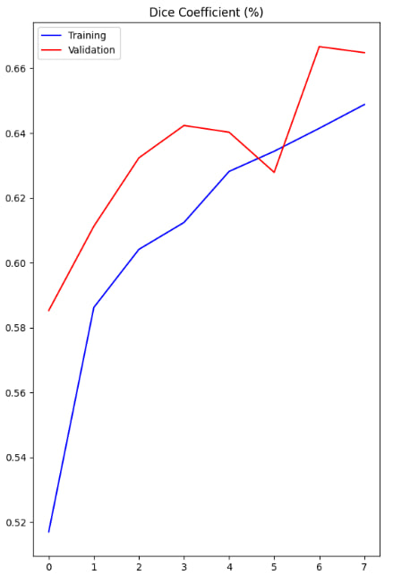
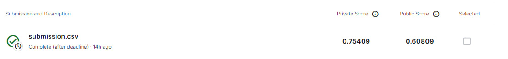

# Airbus Ship Detection Test Task

### Summary
This repository contains a project on segmentation using airbus ship detection dataset. A research of the data was carried out, where a high imbalance of classes was noticed, and therefore only images with ships were selected. Then a training dataset was randomly generated, which was then augmented using datagenerators. The model used the U-net architecture, with the addition of a pre-trained model as an encoder, as well as spatial attention to improve dice score.

### How to run:
* Download <a href='https://www.kaggle.com/c/airbus-ship-detection/data'>Kaggle Competition</a> data 

* Prepare folder structure
  - Create folder, inside it, also create 'airbus-ship-detection' folder and extract Kaggle data into input.
* Run `eda.ipynb` to create training dataframe.
* ### To train
```
python train.py
```
* ### To predict
```
python inference.py 'path'
```
path - if you don't want to download all the files from the project and you just want to test, 
you can just use your own path to the Kaggle data directory, for example "python inference.py airbus-ship-detection".
### Model results

#### Model info
I have trained model for 8 epochs with 35364 train and 8838 validation masks, batch size 16, using basic image augmentation to aid in training.
Metric - dice score, loss function - dice loss.

#### Model training history




#### Inference example


### Project Structure:
```bash
├───EDA.ipynb # EDA, preprocessing data
├───train.py # Define and train model
├───inference.py # Model inference 
├───constants.py # Declare variables that used everywhere
├───data_generators.py # Create dataframes, data generators and augment pictures
├───metrics.py # File with losses and score
├───useful_functions.py # File with functions for working with rle and model
├───inference # Results
│   ├───submission.txt
│   └───images
├───plots 
│   ├───Dice-score.jpg
│   ├───kaggle.jpg
│   └───loss.jpg
├───checkpoints # Folder with best model
│   └───upres_model.h5
└───requirements.txt # Library that was used
```

### Conclusion and ideas for enhansing:
As we can see from the loss and cube graphs, the model works quite well, but has not reached a plateau yet, because unfortunately my computing resources on Kaggle have run out. But the score (0.75409) in the leaderboard shows that the model is doing quite well, although of course there is room for further improvement. Possible improvement: improvement of pre-processing, application of filters that will increase the accuracy of feature selection. An ensemble with a classification model was tested, unfortunately, it did not significantly increase accuracy, so I abandoned it. But it makes sense to make an ensemble of several U-nets that will complement each other's predictions. Also, of course, it is worth conducting more experiments with the hyperparameters of the model. Despite everything, I believe that the model has shown good results and has a tendency to improve.

Changes: an increase in accuracy in the leaderboard of 0.2 was obtained, which is a very significant achievement. Changed the loss function, the prediction mechanism, added additional cleanup of damaged images, and most importantly, there is no longer a need to store masks separately, which took a lot of time, now it is all done in the generator.