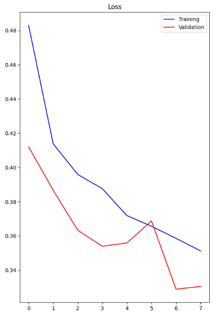
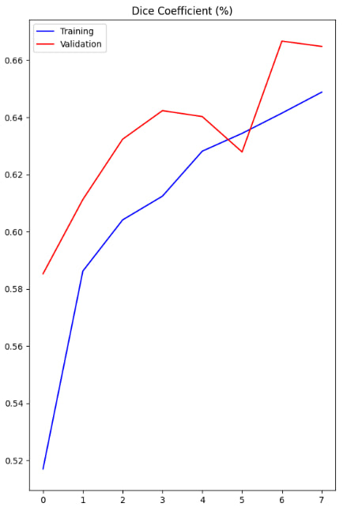

# Airbus Ship Detection Test Task

### Summary
This repository contains a project on segmentation using airbus ship detection dataset. A research of the data was carried out, where a high imbalance of classes was noticed, and therefore only images with ships were selected. Then a training dataset was randomly generated, which was then expanded using datagenerators. The model used the U-net architecture, with the addition of a pre-trained model as an encoder, as well as spatial attention to improve accuracy.

### How to run:
* Download <a href='https://www.kaggle.com/c/airbus-ship-detection/data'>Kaggle Competition</a> data 

* Prepare folder structure
  - Create `projects` folder, inside it, also create `input`, `output` and extract Kaggle data into input.
* Run `eda.ipynb` to create training dataframe 
* ### To train
```
python train.py
```
* ### To predict
```
python inference.py -- 'command'
```

`--compare_to_t` - Compare prediction to ground truth <br>
`--visualize_inference` - Visualize 10 inference results <br>
`--predict_all` - Predict on all test images  <br>
`--show_submission` - Visualize random predictions from RLE encoded submission <br>
### Model results

#### Model info
I have trained model for 20 epochs with 4000 train and 1000 validation images, batch size 10, using basic image augmentation to aid in training.
Metric - dice score, loss function - combination of dice loss and cross-entropy loss.

#### Model training history




### Project Structure:
```bash
├───eda.ipynb # EDA, preprocessing data
├───train.py # Define and train model
├───inference.py # Model inference 
├───checkpoints # Folder with best model
├───constants.py # Declare variables that used everywhere
├───data_prep.py # Create data generators and augment pictures
├───.gitignore
└───requirements.txt # Library that was used
```

### Conclusion and ideas for enhansing:
As we can see from the loss and dice graphs, the model works quite well and reached a plateau. But, the score (0.54) in the leaderboard shows that the model can be better, which is obvious. A possible improvement is: better preprocessing, applying filters that would improve the accuracy of feature extraction. It was also a good idea to use two models: the first model - classifies whether there are ships in the image and outputs a csv file with a binary classification of the presence of a ship, the second model - is already based on the dataset from the previous model and searches for those images where there are ships, actually ships. I did not have time to finish this idea. Also, of course, it is worth conducting more experiments with hyperparameters of the model, starting from batch size and ending with parameters in callbacks. The main problem was the limited computing resources, namely the required large amount of memory and gpu. Despite everything, I believe that the model has shown good results and has a tendency to improve.